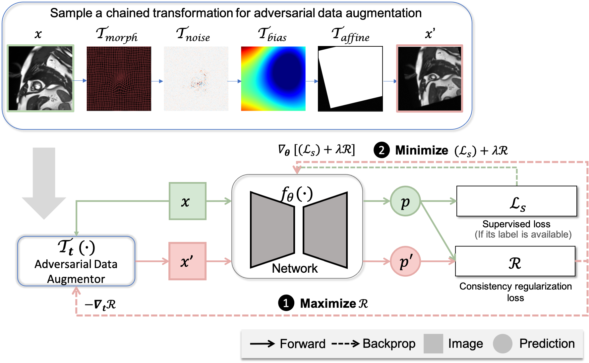

# Adversarial Data Augmentation with Chained Transformations (AdvChain)

This repo contains the pytorch implementation of adversarial data augmentation, which supports to perform adversarial training on a chain of image photometric transformations and geometric transformations for improved consistency regularization.
Please cite our work if you find it useful in your work

## Introduction



For more details please see our paper on [Arxiv](https://arxiv.org/abs/2108.03429) and

## Requirements

- matplotlib>=2.0
- seaborn>=0.10.0
- numpy>=1.13.3
- SimpleITK>=2.1.0
- skimage>=0.0
- torch>=1.9.0

## Set Up

1.  Install PyTorch and other required python libraries with:
    ```
    pip install -r requirements.txt
    ```
2.  Play with the provided jupyter notebook to check the enviroments

## Usage

1. You can clone this probject as submodule in your project.

- Add submodule:
  ```
  git submodule add https://github.com/cherise215/advchain.git
  ```
- Add the lib path to the file where you import our library:
  ```
  sys.path.append($path-to-advchain$)
  ```

2. Import the library and then add it to your training codebase. Please refer to examples under the `example/` folder for more details.

## Citation

If you find this useful for your work, please consider citing

```
@ARTICLE{Chen_2021_Enhancing,
  title  = "Enhancing {MR} Image Segmentation with Realistic Adversarial Data Augmentation",
  journal = {arXiv preprint},
  author = "Chen, Chen and Qin, Chen and Ouyang, Cheng and Wang, Shuo and Qiu,
            Huaqi and Chen, Liang and Tarroni, Giacomo and Bai, Wenjia and
            Rueckert, Daniel",
    year = 2021,
    note = {\url{https://arxiv.org/abs/2108.03429}}
}


@INPROCEEDINGS{Chen_MICCAI_2020_Realistic,
  title     = "Realistic Adversarial Data Augmentation for {MR} Image
               Segmentation",
  booktitle = "Medical Image Computing and Computer Assisted Intervention --
               {MICCAI} 2020",
  author    = "Chen, Chen and Qin, Chen and Qiu, Huaqi and Ouyang, Cheng and
               Wang, Shuo and Chen, Liang and Tarroni, Giacomo and Bai, Wenjia
               and Rueckert, Daniel",
  publisher = "Springer International Publishing",
  pages     = "667--677",
  year      =  2020
}

```
