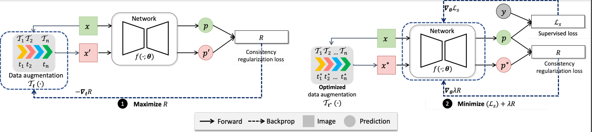
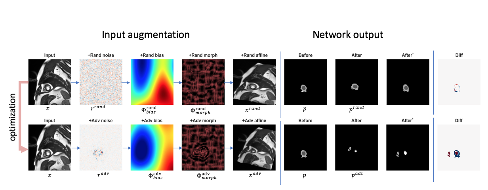

<p align="center">
  
  </a>
</p>

# Adversarial Data Augmentation with Chained Transformations (AdvChain)

This repo contains the pytorch implementation of adversarial data augmentation, which supports to perform adversarial training on a chain of image photometric transformations and geometric transformations for improved consistency regularization.
Please cite our work if you find it useful in your work.

[Full Paper](https://authors.elsevier.com/sd/article/S1361-8415(22)00230-4)
## License:
All rights reserved. 


## Citation
If you find this useful for your work, please consider citing

```
@ARTICLE{Chen_2021_Enhancing,
  title  = "Enhancing {MR} Image Segmentation with Realistic Adversarial Data Augmentation",
  journal = {Medical Image Analysis},
  author = "Chen, Chen and Qin, Chen and Ouyang, Cheng and Wang, Shuo and Qiu,
            Huaqi and Chen, Liang and Tarroni, Giacomo and Bai, Wenjia and
            Rueckert, Daniel",
    year = 2022,
    note = {\url{https://authors.elsevier.com/sd/article/S1361-8415(22)00230-4}}
}

@INPROCEEDINGS{Chen_MICCAI_2020_Realistic,
  title     = "Realistic Adversarial Data Augmentation for {MR} Image
               Segmentation",
  booktitle = "Medical Image Computing and Computer Assisted Intervention --
               {MICCAI} 2020",
  author    = "Chen, Chen and Qin, Chen and Qiu, Huaqi and Ouyang, Cheng and
               Wang, Shuo and Chen, Liang and Tarroni, Giacomo and Bai, Wenjia
               and Rueckert, Daniel",
  publisher = "Springer International Publishing",
  pages     = "667--677",
  year      =  2020
}

```


## News:
- [x] [2022-10-08] now support generating anatomical structure preserving transformations, with custom padding mode for warping images that are normalized NOT in [0,1]. Please see Q4, and Q5 below for reference.
- [x] [2022-07-16] now support 3D augmentation (beta)! Please see `advchain/example/adv_chain_data_generation_cardiac_2D_3D.ipynb` to find example usage.

## Introduction

AdvChain is a **differentiable** data augmentation library, which supports to augment 2D/3D image tensors with *optimized* data augmentation parameters. It takes both image information and network's current knowledge into account, and utilizes these information to find effective transformation parameters that are beneficial for the downstream segmentation task. Specifically, the underlying image transformation parameters are optimized so that the dissimilarity/inconsistency between the network's output for clean data and the output for perturbed/augmented data is maximized.



As shown below, the learned adversarial data augmentation focuses more on deforming/attacking region of interest, generating realistic adversarial examples that the network is sensitive at. In our experiments, we found that augmenting the training data with these adversarial examples are beneficial for enhancing the segmentation network's generalizability.


For more details please see our paper on [arXiv](https://arxiv.org/abs/2108.03429).

## Requirements

- matplotlib>=2.0
- seaborn>=0.10.0
- numpy>=1.13.3
- SimpleITK>=2.1.0
- skimage>=0.0
- torch>=1.9.0

## Set Up
1.  Upgrade pip to the latest:
    ```
    pip install --upgrade pip
    ```
1.  Install PyTorch and other required python libraries with:
    ```
    pip install -r requirements.txt
    ```
2.  Play with the provided jupyter notebook to check the enviroments, see `example/adv_chain_data_generation_cardiac_2D_3D.ipynb` to find example usage.

## Usage

1. You can clone this probject as submodule in your project.

- Add submodule:
  ```
  git submodule add https://github.com/cherise215/advchain.git
  ```
- Add the lib path to the file where you import our library:
  ```
  sys.path.append($path-to-advchain$)
  ```

2. Import the library and then add it to your training codebase. Please refer to examples under the `example/` folder for more details.

### Example Code
First set up a set of transformation functions:
```python
## set up different transformation functions
n,c,h,w = data.size()
spatial_dims=2 ## for 2D, change to 3 for 3D
augmentor_bias= AdvBias(
                 spatial_dims=spatial_dims,
                 config_dict={'epsilon':0.3,
                 'control_point_spacing':[h//2,w//2],
                 'downscale':2,
                 'data_size':(n,c,h,w),
                 'interpolation_order':3,
                 'init_mode':'random',
                 'space':'log'},debug=debug)

           

augmentor_noise= AdvNoise( 
                spatial_dims=spatial_dims,
                config_dict={'epsilon':1,
                'xi':1e-6,
                 'data_size':(n,c,h,w)},
                 debug=debug)
    
augmentor_affine= AdvAffine(
                spatial_dims=spatial_dims,
                config_dict={
                 'rot':30.0/180,
                 'scale_x':0.2,
                 'scale_y':0.2,
                 'shift_x':0.1,
                 'shift_y':0.1,
                 'data_size':(n,c,h,w),
                 'forward_interp':'bilinear',
                 'backward_interp':'bilinear'},
                 debug=debug)

augmentor_morph= AdvMorph(
                spatial_dims=spatial_dims,
                config_dict=
                {'epsilon':1.5,
                 'data_size':(n,c,h,w),
                 'vector_size':[h//16,w//16],
                 'interpolator_mode':'bilinear'
                 }, 
                 debug=debug)

```
We can then compose them by putting them in a list with a specified order and initialize a solver to perform random/adversarial data augmentation
```python
transformation_chain = [augmentor_noise,augmentor_bias,augmentor_morph, augmentor_affine] ## specify an order: noise->bias->morph->affine
solver = ComposeAdversarialTransformSolver(
        chain_of_transforms=transformation_chain,
        divergence_types = ['mse','contour'], ### you can also change it to 'kl'.
        divergence_weights=[1.0,0.5],
        use_gpu= True,
        debug=True,
        if_norm_image=True ## if true, it will allow to preserve the intensity range despite the data augmentation.
       )
```
To perform random data augmentation, simply initialize transformation parameters and call `solver.forward`

```python
solver.init_random_transformation()
rand_transformed_image = solver.forward(data.detach().clone())
```
To perform adversarial data augmentation for adversarial training, a 2D/3D segmentation model `model` is needed.
```python
consistency_regularization_loss = solver.adversarial_training(
        data=data,model=model,
        n_iter=1, ## number of adversarial optimization steps, if set to 0, then it will act as a standard consistency loss calculator
        lazy_load=[True]*len(transformation_chain), ## if set lazy load to true, it will use the previous sampled random bias field as initialization.
        optimize_flags=[True]*len(transformation_chain), ## specify which transformation function to be optimized
        step_sizes=1,power_iteration=[False]*len(transformation_chain))

adv_transformed_image = solver.forward(data.detach().clone()) ## adversarial augmented image
```
A pseudo-code for supervised training with adversarial data augmentation:
```python
from advchain.common.utils import random_chain

for data in loader:
    image: Tensor = data["images"]
    target: Tensor = data["gt"]
  
    net.zero_grad()
    ## 1. sample a chain with a random order
    transformation_family = [augmentor_noise,augmentor_bias,augmentor_morph,augmentor_affine]
    one_chain = random_chain(transformation_family.copy(),max_length=len(transformation_family))

    ## 2. set up a solver to optimize this chain
    solver = ComposeAdversarialTransformSolver(
        chain_of_transforms=one_chain,
        divergence_types = ['mse','contour'], ### you can also change it to 'kl'
        divergence_weights=[1.0,0.5],
        use_gpu= True,
        debug=False,
        if_norm_image=True, ## turn it on when intensity range needs to be preserved. Otherwise, turn it off. 
       )
    solver.init_random_transformation()
    ## 3. optimize transformation parameters to augment data and compute regularization loss
    adv_consistency_reg_loss = solver.adversarial_training(
      data = image,
      model = net,
      n_iter = 1, ## set up  the number of iterations for updating the transformation model.
      lazy_load = [False]*len(one_chain), 
      optimize_flags = [True]*len(one_chain),  ## you can also turn off adversarial training for one particular transformation
      step_sizes = 1) ## set up step size, you can also change it to a list of step sizes, so that different transformation have different step size

    ## 4. standard training 
    net.zero_grad()
    output: Tensor = net(image)
    loss = supervised_loss(output, target)
    total_loss = loss + w * adv_consistency_reg_loss ## for semi-supervised learning, it is better to perform linear ramp-up to schedule the weight w.
    total_loss.backward()
    optimizer.step()
```


A pseudo-code for semi-supervised training with adversarial data augmentation:
```python
from advchain.common.utils import random_chain
transformation_family = [augmentor_noise,augmentor_bias,augmentor_morph,augmentor_affine]

for data in loader:
    image: Tensor = data["images"]
    target: Tensor = data["gt"]
    image_u: Tensor = data["unlabelled_images"]

    net.zero_grad()
    ## 1. sample a chain with a random order
    one_chain = random_chain(transformation_family.copy(),max_length=len(transformation_family))

    ## 2. set up a solver to optimize this chain
    solver = ComposeAdversarialTransformSolver(
        chain_of_transforms=one_chain,
        divergence_types = ['mse','contour'], ### you can also change it to 'kl'
        divergence_weights=[1.0,0.5],
        use_gpu= True,
        debug=False,
        if_norm_image=True, ## turn it on when intensity range needs to be preserved. Sometimes, it works better when this option is off.
       )
    solver.init_random_transformation()
    ## 3. optimize transformation parameters to augment data and compute regularization loss
    adv_consistency_reg_loss = solver.adversarial_training(
      data = image,
      model = net,
      n_iter = 1, ## set up  the number of iterations for updating the transformation model.
      lazy_load = [False]*len(one_chain), 
      optimize_flags = [True]*len(one_chain),  ## you can also turn off adversarial training for one particular transformation
      step_sizes = 1) ## set up step size, you can also change it to a list of step sizes, so that different transformation have different step size

    ## 4. perform data augmentation for the unlabelled data:
    one_chain = random_chain(transformation_family.copy(),max_length=len(transformation_family))
    solver = ComposeAdversarialTransformSolver(
        chain_of_transforms=one_chain,
        divergence_types = ['mse','contour'], ### you can also change it to 'kl'
        divergence_weights=[1.0,0.5],
        use_gpu= True,
        debug=False,
        if_norm_image=True, ## turn it on when intensity range needs to be preserved
       )
    solver.init_random_transformation()
    ## 5. optimize transformation parameters to augment unlabelled data and compute regularization loss
    unlabelled_adv_consistency_reg_loss = solver.adversarial_training(
      data = image_u,
      model = net,
      n_iter = 1, ## set up  the number of iterations for updating the transformation model.
      lazy_load = [False]*len(one_chain), 
      optimize_flags = [True]*len(one_chain),  ## you can also turn off adversarial training for one particular transformation
      step_sizes = 1) ## set up step size, you can also change it to a list of step sizes, so that different transformation have different step size
  

    ## 6. standard training 
    net.zero_grad()
    output: Tensor = net(image)
    loss = supervised_loss(output, target)
    total_loss = loss + w * (adv_consistency_reg_loss+unlabelled_adv_consistency_reg_loss) ## for semi-supervised learning, it is better to perform linear ramp-up to schedule the weight w.
    total_loss.backward()
    optimizer.step()
```


## Guide:
1. Please perform adversarial data augmentation *before* computing standard supervised loss
2. For networks with dropout layers, please replace `nn.Dropout2d` or `nn.Dropout3d` with fixable dropout layers to allow optimization with fixed network structure. We provide 2D, and 3D fixable dropout layers in `advchain.common.layers.Fixable2DDropout`, `advchain.common.layers.Fixable3DDropout`. 
3. for semi-supervised learning, please perform adversarial data augmentation on labelled and unlabelled batch *separately*. 

## FAQ
- Q1. My network has multiple output branches, how can I specify which one to be used to guide adversarial data augmentation?
- A1. Currently, by default, our solver only supports model with a single output. One can specify the output from which branch by reimplementing the function in `get_net_output(self,model, data)`, which can be found in `advchain/augmentor/adv_compose_solver.py`.

- Q2: Can I use other losses?
- A2. Yes. Currently we support mean squared loss ('mse'), kl loss ('kl'), and contour loss ('contour'). You can also implement your preferred one in `calc_segmentation_consistency`, which is located in `advchain/common/loss.py`. and  change `divergence_types = ['your loss name'],  divergence_weights=[1.0]` when initializing `ComposeAdversarialTransformSolver`.

- Q3: Can I add my own transformation function?
- A3. Yes. AdvChain lets you create your own custom image transformation function to implement in your projects. This is achieved by extending [advchain/augmentor/adv_transformation_base](advchain/augmentor/adv_transformation_base.py) and implementing basic functions.

- Q4: My images are normalized to be within [-1,1] where background pixels are all -1s. Any modifications I need to make to generate realistic images?
- A4: Currently, we only test on images with [0,1]. However, it is easy to be adapted to other range. For photometric transformations, there is nothing you need to change. Unless you want to AdvChain focus on non-background regions to attack, this can be achieved by  setting `ignore_values = <backrgound pixel value>` when you instanitialzie `AdvNoise` and `AdvBias`, e.g. `AdvBias (..., ignore_values=-1)`. For geometric transformations, you need to check the `image_padding_mode` in `AdvAffine` to make sure filled values are consistent with background values in the original images. Currently, by default we use zero paddings to fill regions out-of-image after transformation. To customize padding values, you can specify `image_padding_mode` to a particular value, e.g. `AdvAffine(...,image_padding_mode=-1)` or `AdvAffine(...,image_padding_mode='lowest')`. The latter will fill those out-of-image regions with the lowest values in the orginal input. For local deformations, similarly, you can specify ``AdvMorph(...,image_padding_mode=-1` for this case.

- Q5: I would like to perform adversarial data generation while the anatomy is still preserved and visible. How can I achieve this?
- A5: AdvChain allows to generate anatomical preserving images by adding L2 penalty. Simply provide anatomical labels via` anatomy_mask_images=<mask>` when you call `adversarial_training` function. You may need to adjust the learning rate, the regularization weight, and the number of steps to find a feasible solution. As this becomes constrained optimization with soft constraints, it may require more steps with smaller step sizes to find feasible solution. Yet, it is not guaranteed. So, if advchain fails to find one that satisfy these constraint in a limited time window, it will run random augmentation instead, and return one that can meet the constraint.

